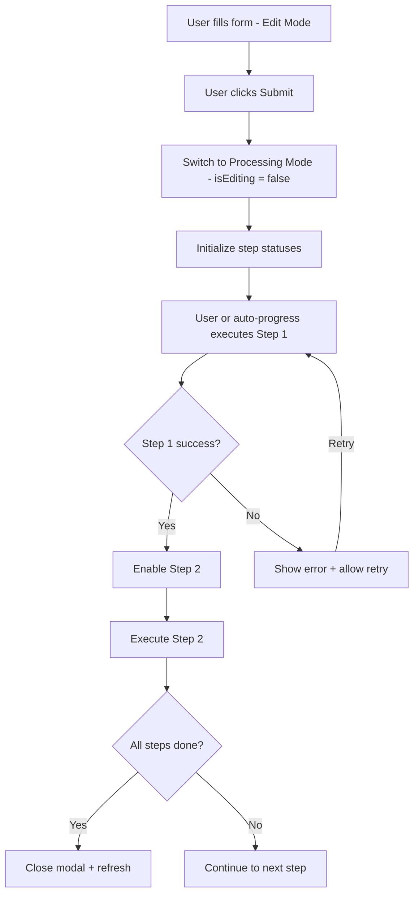

# Multi-Step Transaction Architecture

> Reference document for building multi-step transaction workflows in iBird.
> All components that require multiple sequential Hedera transactions should follow these patterns.

---

## 1. Core Pattern Overview

Every multi-step workflow in iBird follows a consistent architecture:



---

## 2. Core Interfaces

### 2.1 StepStatus Interface

Every component uses this identical interface:

```typescript
interface StepStatus {
  status: "idle" | "loading" | "success" | "error";
  disabled: boolean;
}
```

**Status meanings:**
| Status | Meaning | UI |
|--------|---------|-----|
| `idle` | Ready to execute, waiting for user action or auto-progress | Yellow/cyan dot, Start button |
| `loading` | Currently executing | Pulsing cyan dot, Processing... text |
| `success` | Completed successfully | Green dot, Done button |
| `error` | Failed, can be retried | Red dot, Retry button |

**Disabled flag:**

- `disabled: true` — Step cannot be clicked; waiting for prerequisite steps
- `disabled: false` — Step is available for execution

### 2.2 Steps Interface Pattern

Each component defines its own steps interface. Examples:

```typescript
// Profile creation (6 steps)
interface ProfileStepStatuses {
  uploadPicture?: StepStatus; // Optional - only if image provided
  uploadBanner?: StepStatus; // Optional - only if banner provided
  createUserProfileTopic: StepStatus;
  initiateUserProfileTopic: StepStatus;
  associateNFTProfileToken: StepStatus;
  mintTransferFreezeNFT: StepStatus;
}

// Channel creation (4 steps)
interface ChannelCreationSteps {
  createTopic?: StepStatus;
  sendIdentifier?: StepStatus;
  arweave?: StepStatus; // Optional - only if image provided
  updateProfile: StepStatus;
}

// Poll creation (4 steps)
interface PollStepStatuses {
  createTopic: StepStatus;
  publishExplore: StepStatus;
  arweave?: StepStatus; // Optional - only if media provided
  sendPoll: StepStatus;
}

// Thread creation (dynamic steps per message)
interface ThreadStepStatuses {
  createTopic: StepStatus;
  explorer: StepStatus;
  messages: {
    [messageId: string]: MessageStepStatuses;
  };
}

interface MessageStepStatuses {
  arweave?: StepStatus;
  send: StepStatus;
}
```

**Key pattern:** Optional steps use `?` and are set to `undefined` when not needed. This allows the step to be completely hidden from the UI.

---

## 3. State Management Pattern

### 3.1 Required State Variables

Every multi-step component uses these state variables:

```typescript
// Process tracking
const [stepStatuses, setStepStatuses] = useState<MyStepStatuses>({ ... });

// Auto-progression
const [autoProgress, setAutoProgress] = useState(false);
const autoProgressRef = useRef(false);         // Reliable ref for closures
const [countdown, setCountdown] = useState(0);
const [autoProgressDisabledByError, setAutoProgressDisabledByError] = useState(false);

// Edit vs Processing mode
const [isEditing, setIsEditing] = useState(true);
```

### 3.2 Why `autoProgressRef` Exists

React state updates are asynchronous. Inside `useEffect` callbacks and `setTimeout` closures, `autoProgress` state may be stale. The `autoProgressRef` is a `useRef` that stays current:

```typescript
// ❌ Wrong - stale closure
if (autoProgress) {
  /* may be stale */
}

// ✅ Correct - always current
if (autoProgressRef.current) {
  /* always up to date */
}
```

Both must be kept in sync:

```typescript
setAutoProgress(newValue);
autoProgressRef.current = newValue;
```

---

## 4. Step Execution Flow

### 4.1 Step Handler Pattern

Every step handler follows this structure:

```typescript
const handleStepX = async () => {
  // 1. Set step to loading
  setStepStatuses((prev) => ({
    ...prev,
    stepX: { status: "loading", disabled: true },
  }));

  // 2. Execute via safeAsyncWrapper
  const result = await safeAsyncWrapper(
    async () => {
      // ... actual operation ...
      return result;
    },
    "Step X Context",
    (errorMessage) => {
      // 3a. Error handler - set step to error
      setStepStatuses((prev) => ({
        ...prev,
        stepX: { status: "error", disabled: false },
      }));

      // Stop auto-progression on error
      if (autoProgressRef.current) {
        disableAutoProgression("Step X error");
      }
    },
  );

  // 3b. Success handler - enable next step
  if (result) {
    setStepStatuses((prev) => ({
      ...prev,
      stepX: { status: "success", disabled: true },
      stepY: { status: "idle", disabled: false }, // Enable next step
    }));
    toast.success("Step X completed!");

    // 4. Auto-progress to next step
    if (autoProgressRef.current) {
      setTimeout(() => {
        handleStepY();
      }, 1000); // 1-2 second delay between steps
    }
  }
};
```

### 4.2 safeAsyncWrapper Pattern

Every component implements this wrapper to handle wallet/transaction errors safely:

```typescript
const safeAsyncWrapper = async (
  operation: () => Promise<unknown>,
  context: string,
  onError?: (error: string) => void,
): Promise<unknown> => {
  try {
    // Pre-validate wallet
    const walletIsValid = await validateWalletState();
    if (!walletIsValid) throw new Error("Wallet not connected");

    // Execute with timeout
    const timeoutPromise = new Promise((_, reject) => {
      setTimeout(() => reject(new Error("Timed out")), 30000);
    });
    return await Promise.race([operation(), timeoutPromise]);
  } catch (error) {
    // Classify error: USER_REJECT, Query.fromBytes, timeout, etc.
    // Call onError callback
    // Manage auto-progression state
    return null;
  }
};
```

**Error classification hierarchy:**

1. `USER_REJECT` → Stop auto-progress, show "Rejected by user"
2. `Query.fromBytes` → Wallet sync issue, may auto-retry
3. `timeout` → Show timeout, offer retry
4. Other → Generic error, stop auto-progress

### 4.3 validateWalletState Pattern

Pre-checks wallet connectivity before every transaction:

```typescript
const validateWalletState = async (): Promise<boolean> => {
  try {
    if (!accountId) throw new Error("Not connected");
    const testId = String(accountId);
    if (!testId || testId === "undefined") throw new Error("Invalid");
    return true;
  } catch {
    return false;
  }
};
```

---

## 5. Auto-Progression System

### 5.1 Architecture

Auto-progression is a toggle that, when enabled, automatically starts the next step after the previous one completes. It uses two mechanisms:

**Mechanism 1: Direct callback** — In the success handler of each step, check `autoProgressRef.current` and call the next handler:

```typescript
if (autoProgressRef.current) {
  setTimeout(() => handleNextStep(), 1000);
}
```

**Mechanism 2: `useEffect` monitoring** — For steps where the result is stored in state (like a topic ID), use `useEffect` to detect when the value becomes available:

```typescript
useEffect(() => {
  if (autoProgressRef.current && topicId && topicId.trim() !== "") {
    const nextStep = stepStatuses.nextStep;
    if (nextStep?.status === "idle" && !nextStep.disabled) {
      setTimeout(() => handleNextStep(), 1000);
    }
  }
}, [topicId, stepStatuses.nextStep, autoProgressRef.current]);
```

### 5.2 disableAutoProgression

Called when any step fails:

```typescript
const disableAutoProgression = (reason: string) => {
  console.log(`Disabling auto-progression: ${reason}`);
  setAutoProgress(false);
  autoProgressRef.current = false;
  setCountdown(0);
  setAutoProgressDisabledByError(true);
};
```

### 5.3 resetAutoProgression

Called when user clicks "Retry" after auto-progression is disabled:

```typescript
const resetAutoProgression = () => {
  setAutoProgressDisabledByError(false);
  setAutoProgress(true);
  autoProgressRef.current = true;

  // Find first failed or idle step and start it
  const stepOrder = ["step1", "step2", "step3"];
  const failedStep = stepOrder.find(
    (s) => stepStatuses[s]?.status === "error" && !stepStatuses[s]?.disabled,
  );

  if (failedStep) {
    setTimeout(() => startStep(failedStep), 1000);
  }
};
```

### 5.4 Auto-Progress Toggle UI

Standard toggle used across all components:

```
[Auto-progress] [Toggle: ON/OFF] [Status badge] [Retry button if error]
```

When toggled ON:

1. Check wallet connection
2. Find first available (idle + not disabled) step
3. Start that step after 500ms delay

---

## 6. UI Rendering Pattern

### 6.1 Two-Mode Layout

Every multi-step component has two render modes:

```typescript
return (
  <div>
    {isEditing ? renderEditForm() : renderProcessingSteps()}
  </div>
);
```

- **Edit mode**: Form with inputs, validation, submit button
- **Processing mode**: Step-by-step progress view with auto-progress toggle

### 6.2 renderStepButton Pattern

Every component implements this function to render consistent step UI:

```typescript
const renderStepButton = (
  step: keyof StepsInterface,
  label: string,
  handler: () => void
) => {
  const status = stepStatuses[step];
  if (!status) return null;  // Skip undefined optional steps

  return (
    <div className="flex justify-between items-center p-4 ...">
      {/* Left: Status dot + label + status message */}
      <div>
        <div className={`w-2 h-2 rounded-full ${colorByStatus}`} />
        <h3>{label}</h3>
        {status.status === "error" && <p>Failed. Please try again.</p>}
        {status.status === "loading" && <p>Processing...</p>}
        {status.status === "success" && <p>Completed successfully</p>}
      </div>

      {/* Right: Action button */}
      <button onClick={handler} disabled={status.disabled || status.status === "loading"}>
        {status.status === "loading" ? "Processing..."
         : status.status === "success" ? "Done"
         : status.status === "error" ? "Retry"
         : "Start"}
      </button>
    </div>
  );
};
```

---

## 7. Step Sequencing Patterns

### 7.1 Linear Sequential

Steps must complete in exact order. Each step enables the next.

```
Step 1 → Step 2 → Step 3 → Done
```

Used by: Channel creation, Group creation, Profile update

### 7.2 Conditional Sequential

Some steps are optional. The flow adapts based on conditions.

```
[Upload Picture?] → [Upload Banner?] → Create Topic → Init Profile → Associate Token → Mint NFT
```

Used by: Profile creation (picture/banner are optional)

### 7.3 Parallel Then Sequential

Independent steps can run in parallel, then merge.

```
Upload Picture ──┐
                  ├→ Create Topic → Init Profile → ...
Upload Banner  ──┘
```

Used by: Profile creation (picture and banner uploads are independent but both must complete before topic creation)

### 7.4 Dynamic Step Count

Steps are generated dynamically based on user input.

```
Create Topic → Explorer Post → [Message 1: Upload? → Send] → [Message 2: Upload? → Send] → ...
```

Used by: Thread creation (variable number of messages)

---

## 8. Components Using This Pattern

| Component      | File                                                                      | Steps    | Pattern                |
| -------------- | ------------------------------------------------------------------------- | -------- | ---------------------- |
| Create Profile | [`create_new_profile.tsx`](../components/profile/create_new_profile.tsx)  | Up to 6  | Conditional Sequential |
| Update Profile | [`update_profile.tsx`](../components/profile/update_profile.tsx)          | Up to 3  | Conditional Sequential |
| Create Channel | [`create_new_channel.tsx`](../components/channels/create_new_channel.tsx) | Up to 4  | Conditional Sequential |
| Update Channel | [`update_channel.tsx`](../components/channels/update_channel.tsx)         | Up to 2  | Linear Sequential      |
| Create Group   | [`create_new_group.tsx`](../components/groups/create_new_group.tsx)       | Up to 4  | Conditional Sequential |
| Update Group   | [`update_group.tsx`](../components/groups/update_group.tsx)               | Up to 2  | Linear Sequential      |
| Send Post      | [`send_new_post.tsx`](../components/send%20message/send_new_post.tsx)     | 2        | Linear Sequential      |
| Send Thread    | [`send_new_thread.tsx`](../components/send%20message/send_new_thread.tsx) | 2 + N\*2 | Dynamic Step Count     |
| Send Poll      | [`send_new_poll.tsx`](../components/send%20message/send_new_poll.tsx)     | Up to 4  | Conditional Sequential |
| Add to Thread  | [`add_to_thread.tsx`](../components/send%20message/add_to_thread.tsx)     | Up to 2  | Conditional Sequential |
| Send Ad        | [`send_new_ad.tsx`](../components/billboard/send_new_ad.tsx)              | Up to 3  | Conditional Sequential |

---

## 9. Error Handling Patterns

### 9.1 Error Recovery Hierarchy

```
1. safeAsyncWrapper catches error
2. Classify error type
3. If USER_REJECT → disable auto-progress, show toast
4. If Query.fromBytes → may auto-retry with delay
5. If timeout → show timeout message
6. Call step-specific onError callback
7. Set step status to "error" with disabled: false (allows retry)
```

### 9.2 Global Error Handlers

Profile creation additionally installs global error handlers to prevent page crashes:

```typescript
window.addEventListener("unhandledrejection", handler);
window.addEventListener("error", handler);
```

These catch errors that escape the try/catch blocks, particularly from wallet SDK async operations.

### 9.3 Error Boundary

Profile creation wraps with `ProfileCreationErrorBoundary` class component for React rendering errors:

```typescript
<ProfileCreationErrorBoundary onError={handleBoundaryError}>
  <div>{isEditing ? editForm : processingSteps}</div>
</ProfileCreationErrorBoundary>
```

---

## 10. Hooks Used by Multi-Step Components

| Hook                                                                  | Purpose                             | Used By                               |
| --------------------------------------------------------------------- | ----------------------------------- | ------------------------------------- |
| [`useSendMessage`](../components/hooks/use_send_message.tsx)          | Send messages to Hedera topics      | All                                   |
| [`useCreateTopic`](../components/hooks/use_create_topic.tsx)          | Create new Hedera topics            | Profile, Channel, Group, Thread, Poll |
| [`useUploadToArweave`](../components/media/use_upload_to_arweave.tsx) | Upload media to Arweave             | All with media                        |
| [`useGetProfile`](../components/hooks/use_get_profile.tsx)            | Read profile data                   | Channel, Group, Follow                |
| [`useRefreshTrigger`](../components/hooks/use_refresh_trigger.tsx)    | Trigger UI refresh after completion | All                                   |
| [`useAccountId`](https://hashgraph-react-wallets)                     | Get connected wallet account        | All                                   |
| [`useWallet`](https://hashgraph-react-wallets)                        | Get wallet instance + signer        | Profile (for contract calls)          |
| [`useWatchTransactionReceipt`](https://hashgraph-react-wallets)       | Watch for tx confirmation           | Profile (for contract calls)          |

---

## 11. UI/UX Consistency Requirement

**All new multi-step transaction flows MUST use the exact same UI/UX as the existing components.** The visual design, interaction patterns, and component structure must match:

**Reference components for UI/UX:**

- [`create_new_profile.tsx`](../components/profile/create_new_profile.tsx) — Most comprehensive example with 6 steps, auto-progress, error recovery
- [`send_new_thread.tsx`](../components/send%20message/send_new_thread.tsx) — Dynamic step count example
- [`send_new_poll.tsx`](../components/send%20message/send_new_poll.tsx) — Conditional sequential example
- [`create_new_channel.tsx`](../components/channels/create_new_channel.tsx) — Standard 4-step creation

**Required UI elements (must match existing components exactly):**

- Two-mode layout: edit form → processing steps (same modal structure)
- Step cards with status dot (green/red/cyan/gray) + label + status message
- Right-aligned action button per step (Start/Processing.../Done/Retry)
- Auto-progress toggle with ON/OFF badge and Retry button on error
- Countdown display between auto-progressed steps
- Information preview card at top of processing view
- Cancel button at bottom
- Same Tailwind color scheme: cyan-400 primary, green-400 success, red-400 error, slate backgrounds
- Same font-mono for labels, font-light for descriptions
- Same rounded-lg cards with border-cyan-400/20 borders
- Same shadow-lg shadow-cyan-400/5 effects

**Do NOT:**

- Create a different step card design
- Use different colors or visual patterns
- Skip the auto-progress toggle
- Use different button styles or layouts
- Invent new error display patterns

---

## 12. Checklist for Building New Multi-Step Flows

When creating a new component with multiple transaction steps:

- [ ] Define `StepStatus` interface (or import shared one)
- [ ] Define component-specific steps interface with optional (`?`) steps
- [ ] Add state: `stepStatuses`, `autoProgress`, `autoProgressRef`, `countdown`, `autoProgressDisabledByError`, `isEditing`
- [ ] Implement `validateWalletState()` function
- [ ] Implement `safeAsyncWrapper()` with error classification
- [ ] Implement `disableAutoProgression()` utility
- [ ] Implement `resetAutoProgression()` utility
- [ ] Implement each step handler following the standard pattern (loading → execute → success/error)
- [ ] Add `useEffect` hooks for state-dependent auto-progression
- [ ] Implement `renderStepButton()` for consistent UI
- [ ] Implement `renderEditForm()` and `renderProcessingSteps()` modes
- [ ] Add auto-progress toggle UI
- [ ] Handle step sequencing (enable next step on success)
- [ ] Test: manual step-by-step execution
- [ ] Test: auto-progression happy path
- [ ] Test: error handling and retry
- [ ] Test: user rejection mid-flow
